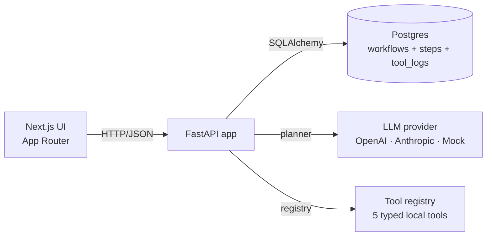

# Forge Agent — Tool-Registry Workflow Runtime

A agent platform. Submit a goal, get a typed step-by-step plan,
approve it, and watch the agent execute through a fixed catalog of safe,
registered tools. Each run produces a Markdown report with a full audit trail
of arguments, outputs, and timings.

The stack runs end-to-end **without an API key** thanks to a built-in mock
planner. Set `USE_MOCK_AI=false` and supply an `OPENAI_API_KEY` or
`ANTHROPIC_API_KEY` to switch providers; nothing else changes.

<p>
  
  
  
  
  
  
</p>

---

## Screenshots

Captures live in `docs/screenshots/`. Drop new ones in and the tables below
update automatically.

| Dashboard | New workflow |
| --- | --- |
|  |  |

| Plan review | Execution timeline |
| --- | --- |
|  |  |

After `bash scripts/seed.sh`, capture the Dashboard, New workflow template
selector, Plan review card, and the Execution timeline + Markdown report on a
completed workflow.

---

## Why this project

"Agent runtimes" is easy to demo and hard to ship. The interesting work isn't
making a model produce a plan — it's the contract around that plan: a closed
tool registry the model can't escape, a status machine that prevents skipping
review, a per-step audit trail you can hand to a reviewer, and a typed
provider abstraction so the planner is one swap away from the next model.

This repo implements that contract end to end:

- **Planning** — a provider-abstracted planner returns a typed `Plan` whose
  steps must reference tools in the registry; unknown tools are rejected
  before the plan is persisted.
- **Approval gate** — workflows pass through `draft → planned → approved →
  running → completed/failed`, enforced server-side. `/execute` on a `draft`
  is a 409.
- **Execution** — the executor runs steps sequentially through the registry,
  recording arguments, outputs, status, and duration for each one.
- **Reporting** — a Markdown report is generated from the audit trail for
  every completed run, downloadable from the UI.

Mock mode is a deliberate design choice: the full product — planning,
approvals, tool execution, reports — works without external dependencies, so
the project clones cleanly and runs with a single command.

---

## Technical highlights

| Area | What's done | Why it matters |
| --- | --- | --- |
| Architecture | Layered backend: thin routes, service layer (`WorkflowService`, `AgentPlannerService`, `AgentExecutorService`, `ReportService`), repository layer, provider layer. | Routes never touch SQLAlchemy or a vendor SDK. Services are reusable in tests, scripts, and future workers. |
| Closed tool registry | A single `ToolRegistry` is the only place tools live. The planner is told which tools exist; the executor only invokes tools by name from the registry. | The agent cannot call code that wasn't explicitly registered. New tools are a single `register()` call documented in [`docs/tool-system.md`](docs/tool-system.md). |
| Typed status machine | `draft → planned → approved/rejected → running → completed/failed`, enforced in `WorkflowService`. Invalid transitions return `409 invalid_state`. | Clients can't drive a workflow into a broken state, and the dashboard's status badges always reflect a real state. |
| Provider abstraction | `LLMService` picks `mock`, `openai`, or `anthropic` from settings at request time. Output is validated against `Plan` via Pydantic. | Swapping providers is one env var. Drift in model output surfaces as a typed error, not a `KeyError`. |
| Per-step audit trail | Each step persists `tool_name`, `arguments`, `output`, `status`, and `duration_ms`. Markdown report renders the trail in order. | Every run is reviewable end to end without re-running it. |
| Error contract | Domain exceptions are mapped to a typed `{error: {code, message, details}}` body via a single FastAPI exception handler. | Frontend branches on `error.code`. No 500s leak stack traces. |
| Observability | `structlog` plus a request-id middleware. Every log line carries request id, method, path, status, duration. | Logs correlate to a single request without a tracing dependency. |
| Testing | Pytest fixtures swap Postgres for SQLite. The suite covers status transitions, planner validation against the registry, executor audit-trail completeness, report rendering, and end-to-end API flow. | The whole suite runs in CI with zero external services. |
| Frontend | shadcn-style primitives, lucide icons, Tailwind tokens for light + dark via CSS variables, status badges, progress bars, downloadable reports. | Looks like a product, not a prototype. |

---

## Architecture



Three deployable units — frontend, backend, database — orchestrated with
`docker compose`. The backend owns the API contract; the frontend is a thin
client.

```
backend/app/
  core/            settings, structlog config, error handlers, safety guards
  api/routes/      thin HTTP adapters (workflows, health)
  schemas/         Pydantic request/response models
  models/          SQLAlchemy ORM (Workflow, ExecutionStep, ToolLog)
  repositories/    data access (no business rules)
  services/        WorkflowService, AgentPlannerService,
                   AgentExecutorService, ReportService, LLMService
  tools/           tool base + registry + 5 registered tools
  db/              engine, session, declarative base
  main.py          FastAPI factory + lifespan
```

### Status machine

```
draft ──plan──▶ planned ──reject──▶ rejected
                    │
                    └─approve──▶ approved ──execute──▶ running ──┬─▶ completed
                                                                  └─▶ failed
```

Transitions are enforced server-side. Calling `/execute` on a `draft` returns
a 409 with `invalid_state` instead of running anything.

See [`docs/architecture.md`](docs/architecture.md) for sequence diagrams and
trade-offs, and [`docs/tool-system.md`](docs/tool-system.md) for how to add a
new tool.

---

## Demo flow

```bash
# 1. Boot the stack.
cp .env.example .env
docker compose up --build

# 2. In a second terminal — three demo workflows in three different states.
bash scripts/seed.sh
```

Then in the browser:

1. **Dashboard** (http://localhost:3000) — KPI cards plus the three demo
   workflows in different states (`completed`, `planned`, `draft`).
2. **Inspect the completed workflow** — *Research agent observability patterns* →
   the *Execution timeline* tab shows each step's tool name, status,
   duration, and output. *Report* renders the Markdown audit trail
   (downloadable).
3. **Approve a planned workflow** — *Draft incident post-mortem outline* is
   in `planned` state with a generated plan. Click *Approve & execute* to
   watch all five tools run.
4. **Create your own** — *New workflow*, pick a template or write a goal,
   *Create & plan*. Then review the plan and approve.
5. **Flip to a live model** *(optional)* — stop the backend, set
   `USE_MOCK_AI=false` and `OPENAI_API_KEY=…` (or `ANTHROPIC_API_KEY=…` +
   `AI_PROVIDER=anthropic`) in `backend/.env`, restart. The UI badge swaps
   *Mock mode* to *Live* and plans come from the real model.

---

## Local setup

### Option A — Docker (recommended)

```bash
cp .env.example .env
docker compose up --build
```

| Service   | URL                              |
| --------- | -------------------------------- |
| Frontend  | http://localhost:3000            |
| Backend   | http://localhost:8000            |
| API docs  | http://localhost:8000/docs       |
| Postgres  | localhost:5432                   |

### Option B — Run services manually

Requires Python 3.12 and Node 20+.

```bash
# 1. Postgres (or set DATABASE_URL=sqlite:///./dev.db in backend/.env)
docker run --name forge-postgres -p 5432:5432 \
  -e POSTGRES_USER=agent -e POSTGRES_PASSWORD=agent -e POSTGRES_DB=workflow_agent \
  -d postgres:16-alpine

# 2. Backend
cd backend
cp .env.example .env
python3.12 -m venv .venv && source .venv/bin/activate
pip install -r requirements.txt
uvicorn app.main:app --reload --port 8000

# 3. Frontend (new terminal)
cd frontend
cp .env.example .env.local
npm install
npm run dev
```

---

## API overview

All endpoints are documented interactively at http://localhost:8000/docs
(OpenAPI / Swagger) and http://localhost:8000/redoc.

| Method | Path                            | Description                                  |
| ------ | ------------------------------- | -------------------------------------------- |
| GET    | `/health`                       | Health + mock-mode + registered tools        |
| GET    | `/tools`                        | Full tool catalog with JSON schemas          |
| GET    | `/workflows/stats`              | KPI counts for the dashboard                 |
| POST   | `/workflows`                    | Create a draft workflow                      |
| GET    | `/workflows`                    | List all workflows (newest first)            |
| GET    | `/workflows/{id}`               | Workflow detail with steps                   |
| POST   | `/workflows/{id}/plan`          | Generate plan → status `planned`             |
| POST   | `/workflows/{id}/approve`       | Approve plan → status `approved`             |
| POST   | `/workflows/{id}/reject`        | Reject plan → status `rejected`              |
| POST   | `/workflows/{id}/execute`       | Run all steps → status `completed`/`failed`  |
| GET    | `/workflows/{id}/report`        | Markdown report (generates if missing)       |

Every response carries an `X-Request-ID` header that matches the structured
log line for that request.

### Sample plan response

```json
{
  "workflow_id": "…",
  "rationale": "Research → summarize → extract → plan → report.",
  "used_mock": true,
  "steps": [
    {
      "position": 1,
      "tool_name": "mock_web_search_tool",
      "description": "Gather background information about: …",
      "arguments": { "query": "…", "max_results": 5 }
    }
  ]
}
```

### Error envelope

```json
{
  "error": {
    "code": "invalid_state",
    "message": "Cannot execute a workflow in status 'draft'. Plan and approve it first.",
    "details": { "status": "draft" }
  }
}
```

---

## Environment variables

Backend (`backend/.env`, template at `backend/.env.example`):

| Variable                    | Default                                | Description                                    |
| --------------------------- | -------------------------------------- | ---------------------------------------------- |
| `DATABASE_URL`              | `postgresql+psycopg2://agent:agent@…`  | SQLAlchemy URL                                 |
| `USE_MOCK_AI`               | `true`                                 | When true (or no key set), uses mock planner   |
| `AI_PROVIDER`               | `openai`                               | `openai` or `anthropic`                        |
| `OPENAI_API_KEY`            | *empty*                                | Required when `USE_MOCK_AI=false`              |
| `OPENAI_MODEL`              | `gpt-4o-mini`                          |                                                |
| `ANTHROPIC_API_KEY`         | *empty*                                |                                                |
| `ANTHROPIC_MODEL`           | `claude-sonnet-4-6`                    |                                                |
| `MAX_STEPS_PER_PLAN`        | `8`                                    | Cap on plan length                             |
| `EXECUTION_TIMEOUT_SECONDS` | `30`                                   | Reserved for future async execution            |
| `CORS_ORIGINS`              | `http://localhost:3000`                | Comma-separated                                |
| `LOG_LEVEL`                 | `INFO`                                 | structlog level                                |

Frontend reads `NEXT_PUBLIC_API_BASE_URL` (default `http://localhost:8000`).

---

## Tests

Backend tests use SQLite — no external services required.

```bash
cd backend
pytest -q
```

Frontend type-check:

```bash
cd frontend
npm run typecheck
```

GitHub Actions runs both on every push and PR (`.github/workflows/`).

---

## Project structure

```
ai-workflow-automation-agent/
├── backend/                 FastAPI service
│   ├── app/
│   │   ├── api/routes/            workflows, health
│   │   ├── core/                  config, logging, errors, security
│   │   ├── db/                    engine, session, base
│   │   ├── models/                SQLAlchemy ORM
│   │   ├── repositories/          data access
│   │   ├── schemas/               Pydantic schemas
│   │   ├── services/              business logic
│   │   ├── tools/                 tool base + registry + 5 tools
│   │   └── main.py
│   ├── tests/                     pytest suite
│   ├── Dockerfile
│   └── requirements.txt
├── frontend/                Next.js 15 App Router
│   ├── app/                       Dashboard, Workflows, New, Detail, Tools
│   ├── components/                ui/ (shadcn-style), layout/, workflow/
│   ├── lib/                       api, types, status, utils
│   ├── Dockerfile
│   └── package.json
├── scripts/seed.sh          Seed three demo workflows
├── docs/architecture.md     Sequence diagrams + trade-offs
├── docs/tool-system.md      How the tool registry works + how to add a tool
├── docker-compose.yml
└── .github/workflows/       backend-tests + frontend-checks
```

---

## Limitations

This is a portfolio-grade implementation, not a hardened product. Known gaps:

- **Synchronous execution.** `/execute` blocks until the run finishes.
- **No retries.** A failed step fails the workflow.
- **No auth or multi-tenancy.** Anyone with API access can do anything.
- **No live progress.** The UI re-fetches after `/execute` returns rather
  than streaming step updates. Adding SSE/websockets is straightforward.
- **`create_all` on boot.** Fine for demos; a real deployment wants Alembic.

---

## Future improvements

- Async execution via Celery / RQ + SSE for live step updates
- Cross-step argument passing (current plans are independent; outputs aren't
  threaded into later step arguments)
- Per-tool rate limits and quotas
- OpenTelemetry tracing and Prometheus metrics
- Workspace auth + per-workspace tool allowlists
- Diff view between successive runs of the same workflow

---

## License

MIT — see [`LICENSE`](LICENSE). Built in 2025 as a portfolio project.
