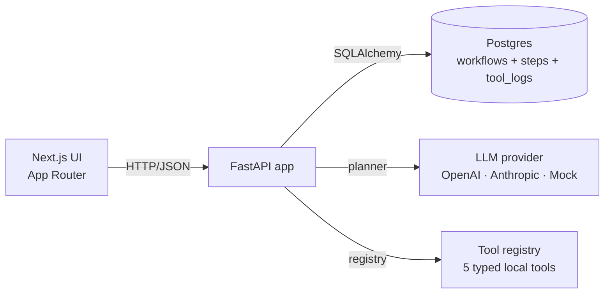
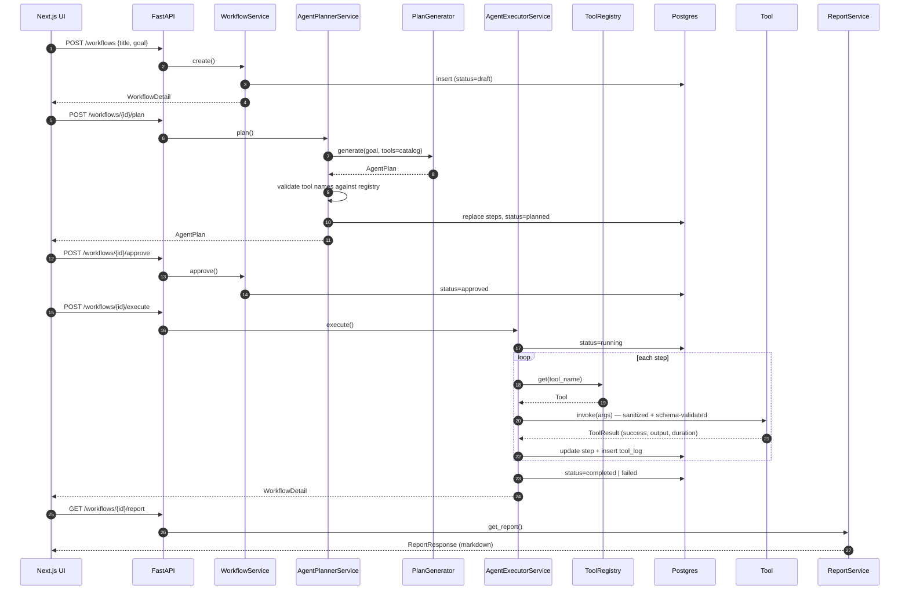

# Architecture

## High-level



Three deployable units — frontend, backend, and Postgres — orchestrated with
`docker compose`. The backend owns the API contract; the frontend is a
typed client.

## Backend layering

```
backend/app/
  core/            settings, structlog config, error handlers, safety guards
  api/routes/      thin HTTP adapters (workflows, health)
  schemas/         Pydantic request/response models
  models/          SQLAlchemy ORM (Workflow, ExecutionStep, ToolLog)
  repositories/   data access (no business rules)
  services/        business logic
  tools/           tool base class + registry + 5 registered tools
  db/              engine + session
  main.py
```

- **Routes** parse and validate, call a service, return a Pydantic schema.
- **Services** own the lifecycle: `WorkflowService` (CRUD + transitions),
  `AgentPlannerService` (LLM → steps), `AgentExecutorService` (runs the plan),
  `ReportService` (assembles or extracts the final Markdown).
- **Repositories** are the only place that constructs SQL queries.
- **Tools** live behind a registry. The executor never touches a Python module
  by name — every tool invocation goes through `ToolRegistry.get(name)`.

## Status machine

```
draft ──plan──▶ planned ──reject──▶ rejected
                    │
                    └─approve──▶ approved ──execute──▶ running ──┬─▶ completed
                                                                  └─▶ failed
```

Transitions are enforced in services. Trying to `/execute` a `draft` workflow
returns a 409 with `invalid_state` instead of silently doing nothing.

## Request flow: plan → approve → execute



## Data model

| Table             | Purpose                                                       |
| ----------------- | ------------------------------------------------------------- |
| `workflows`       | One row per user-submitted goal. Holds status, report, errors |
| `execution_steps` | Ordered children of a workflow. Mutable through the run       |
| `tool_logs`       | Append-only audit log — one row per tool invocation           |

`execution_steps` is the canonical state machine for a step (its status
flips during execution). `tool_logs` is immutable — once a tool ran, the log
row stays exactly as written, even if the step is later retried.

## Provider abstraction (`services/llm_service.py`)

The agent only needs **one** capability from the LLM: take a goal + the
catalog of registered tools and return a structured plan. `PlanGenerator`
captures that in an ABC with three implementations:

- `MockPlanGenerator` — deterministic heuristics keyed off the goal text.
  Always available, never calls a network. CI and local demos run this.
- `OpenAIPlanGenerator` — `openai.chat.completions.create` with
  `response_format=json_object`.
- `AnthropicPlanGenerator` — `anthropic.messages.create`, JSON parsed out of
  the text response.

`get_plan_generator()` returns the mock whenever `USE_MOCK_AI=true` **or** when
the configured provider has no API key. That's how the "runs without a key"
promise is kept.

## Safety boundary

The reason the agent is safe to run unattended is structural, not behavioral:

1. **Closed tool catalog.** The executor only knows how to call tools
   registered in `default_registry`. Even if the LLM hallucinates a tool name,
   the planner rejects the plan before any database write.
2. **Pydantic input validation.** Each tool has an `input_model`; bad arguments
   raise a `ValidationError` instead of silently doing the wrong thing.
3. **Bounded inputs.** `core/security.py` enforces hard limits (string length,
   list size) so the executor cannot be DoS-ed by a planner that fills an
   argument with a megabyte of text.
4. **Local-only tools.** None of the registered tools touch the network,
   filesystem outside the process, or any external service. Adding a tool that
   does requires writing it.
5. **Plan-then-execute.** The state machine forces a human-approval transition
   between planning and execution. The UI surfaces this as the "Approve & execute"
   step on the plan review screen.

## Trade-offs and what would change at scale

- **Synchronous execution.** `POST /workflows/{id}/execute` blocks until the
  last step finishes. A queue (Celery, RQ, SQS) + websockets/SSE for live step
  updates would be the obvious next step.
- **No retries.** A failed step fails the workflow. A scoped retry/skip model
  (and the schema reservation for `skipped` status) is in place but not yet
  wired.
- **Mock providers are intentionally simple.** They prove the loop works
  end-to-end without keys. For demos you can flip `USE_MOCK_AI=false` and add
  an `OPENAI_API_KEY` to switch instantly.
- **`create_all` on boot.** Fine for a portfolio app, but a real deployment
  would use Alembic for migrations.
- **No auth or multi-tenancy.** Add a workspace model and JWT/OIDC before
  shipping shared deployments.
